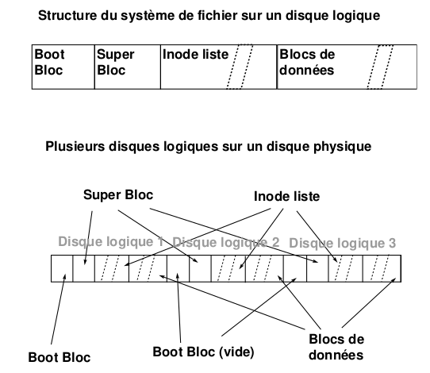

Le système de gestion de fichiers est un outil de manipulation des fichiers et
de la structure d'arborescence des fichiers sur disque. Il a aussi le rôle, sous
UNIX, de conserver toutes les informations dont la pérennité est importante pour
le système (et pour les utilisateurs, bien sûr). Ainsi, tous les objets importants
du système sont référencés dans le système de fichiers (mémoire, terminaux,
périphériques variés, etc.). Le système de gestion de fichiers permet une
manipulation simple des fichiers et gère de façon transparente les différents
problèmes d'accès aux supports de masse :

+ partage : utilisation d'un même fichier / disque par plusieurs utilisateurs
+ efficacité : utilisation de cache, uniformisation des accès
+ droits : protection des éléments importants du système et protection
  inter-utilisateurs
+ alignement : transtypage entre la mémoire et les supports magnétiques

## Le concept de fichier

L'unité logique de base de l'interface du système de gestion de fichiers est le
**fichier**. Un fichier UNIX est une suite finie d'octets matérialisée par des
blocs disques, et une inode qui contient les propriétés du fichier. Le contenu
est entièrement défini par le créateur ; la gestion de l'allocation des
ressources nécessaires est à la seule responsabilité du système. Sous UNIX, les
fichiers ne sont pas typés du point de vue utilisateur : le concept de fichier
permet de proposer un type générique (polymorphe) aux programmeurs, le système
gérant la multiplicité des formats effectifs (différentes marques et conceptions
de disques durs, par exemple). L'inode définit le fichier, soit principalement les
informations suivantes :

+ la localisation sur disque
+ le propriétaire et le groupe propriétaire
+ les droits d'accès des différents utilisateurs
+ la taille
+ les dates de dernier accès, de dernière modification du contenu et de dernier
  changement de l'inode (l'inode UNIX traditionnelle ne stocke pas de date de
  création)

On trouvera sur d'autres systèmes d'autres structures d'information pour décrire
les fichiers : par exemple, NTFS (Windows NT) utilise des enregistrements de la
MFT (*Master File Table*).
*Un nom est lié à un fichier (une référence désigne un fichier), mais un fichier
n'est pas lié à une référence : un fichier peut exister sans avoir de nom dans
l'arborescence.*

## Fichiers ordinaires / Fichiers spéciaux

Le système est un utilisateur du système de gestion de fichiers et, en tant que
créateur, il définit quelques contenus structurés ; ces fichiers auront de ce fait
des accès réglementés. Pour le système, les fichiers sont donc organisés en deux
grandes familles :

+ **les fichiers standards**, par exemple les fichiers texte, les
  exécutables, etc. C'est-à-dire tout ce qui est manipulé et structuré par les
  utilisateurs.
+ **les fichiers spéciaux** : périphériques, mémoire et autres fichiers
  « physiques » ou logiques. Ces fichiers ont une structure interne définie (par
  les développeurs du système) qui doit être respectée, c'est pourquoi leur
  manipulation n'est possible que par l'intermédiaire du système.

  Les fichiers spéciaux de périphériques sont dans le répertoire `/dev`.

  Cette distinction entre fichiers ordinaires et spéciaux vient tout simplement du
  fait que le système est un utilisateur des fichiers comme les autres. Pour
  certains fichiers, le système utilise une structure interne spéciale (d'où le
  nom) qui ne doit pas être modifiée sous peine de comportement indéfini. Pour se
  protéger, le système ne permet pas l'accès direct aux informations : c'est lui
  qui fait toutes les entrées-sorties sur les fichiers spéciaux de façon à en
  assurer l'intégrité. Ceci est indépendant du système de droits d'accès, la
  structure du code du noyau ne permet pas d'autres accès que les accès
  « spéciaux ».

## Organisation utilisateur des disques

Comment permettre aux utilisateurs d'identifier les données sur les supports de
masse ? Le système le plus répandu aujourd'hui est un système arborescent, avec
des fichiers (les répertoires) utilisés comme nœuds de l'arbre, qui permettent de
lister les fichiers et les sous-arbres qu'ils contiennent. D'autres organisations
« plates » existent, où l'on organise les fichiers en utilisant des types et des
extensions de nom de fichier. Les arborescences de fichiers et de catalogues,
organisées comme un graphe acyclique, apparaissent avec le projet MULTICS. Cette
organisation logique du disque a les avantages suivants : une racine, un accès
absolu aisé, une structure dynamique, une grande puissance d'expression et un
graphe acyclique.

L'organisation est arborescente avec quelques connexions supplémentaires (liens
multiples sur un même fichier) qui en font un graphe. Mais ce graphe doit rester
acyclique, pour les raisons suivantes :

1. les algorithmes simples utilisables sur des graphes acycliques, comme le
   parcours ou la vérification des fichiers libres, deviennent beaucoup plus
   difficiles à écrire pour les graphes admettant des cycles ;
2. des algorithmes de ramasse-miettes devraient être utilisés pour savoir si
   certains objets sont utilisés ou non, et pour récupérer les inodes ou blocs
   perdus après un crash ;
3. tous les algorithmes de détection dans un graphe quelconque ont une
   complexité beaucoup plus grande que ceux qui peuvent profiter de l'acyclicité
   du graphe.

Sous UNIX, le graphe est assuré d'être acyclique car il est interdit de créer
des liens physiques supplémentaires vers un répertoire (hormis les entrées `.`
et `..` gérées par le système).

## Les inodes

L'inode est le passage obligé de tous les échanges entre les systèmes de fichiers
et la mémoire. L'inode est la structure qui contient toutes les informations sur
un fichier donné à l'exception de sa référence dans l'arborescence (son nom),
l'arborescence n'étant qu'un outil de référencement des fichiers. Les
informations stockées dans une inode disque sont :

+ utilisateur propriétaire
+ groupe propriétaire
+ type de fichier
+ droits d'accès
+ nombre de liens physiques (noms) pointant sur l'inode
+ date de dernier accès
+ date de dernière modification
+ date de dernière modification de l'inode
+ taille du fichier
+ adresses des blocs-disque contenant le fichier

## Organisation des disques System V

L'organisation disque décrite sur la figure ci-dessous est la plus simple que
l'on puisse trouver sous UNIX. Il en existe d'autres où l'on peut en
particulier placer un même disque logique sur plusieurs disques physiques,
certaines où les blocs sont fragmentables, etc.

+ **Boot bloc** : utilisé au chargement du système
+ **Super bloc** : il contient toutes les informations générales sur le disque
  logique
+ **Inode list** : table des inodes
+ **Blocs** : les blocs de données, chaînés à la création du disque (`mkfs`)

## Adressage des blocs dans les inodes

Le système d'adressage des blocs dans les inodes (System V) consiste en 13
adresses de blocs. Les dix premières adresses pointent directement sur les
blocs de données du fichier. Les trois suivantes sont des adresses indirectes :
la onzième désigne un bloc contenant des adresses de blocs de données (indirection
simple), la douzième un bloc d'adresses de blocs d'adresses (indirection double)
et la treizième ajoute un niveau supplémentaire (indirection triple). L'intérêt de
cette représentation est d'économiser sur la taille des inodes tout en permettant
un accès rapide aux petits fichiers (la majorité des fichiers sont petits), tout
en laissant la possibilité de créer de très gros fichiers.

## Allocation des inodes d'un disque

L'allocation des inodes est réalisée en recherchant dans la zone des inodes du
disque une inode libre. Pour accélérer cette recherche, un tampon d'inodes libres
est géré dans le super bloc ; de plus, l'indice de la première inode libre est
gardé en référence dans le super bloc afin de ne redémarrer la recherche qu'à
partir de la première inode réellement libre.

## Allocation des blocs disques

L'algorithme utilisé pour gérer l'allocation des inodes s'appuie sur le fait que
l'on peut tester si une inode est libre ou non en regardant son contenu. Ceci
n'est plus vrai pour les blocs. La solution est de chaîner les blocs libres. Ce
chaînage est réalisé par blocs d'adresses pour accélérer les accès et profiter
au maximum du buffer cache. Il existe donc un bloc d'adresses dans le super bloc
qui sert de zone de travail pour l'allocateur de blocs.
