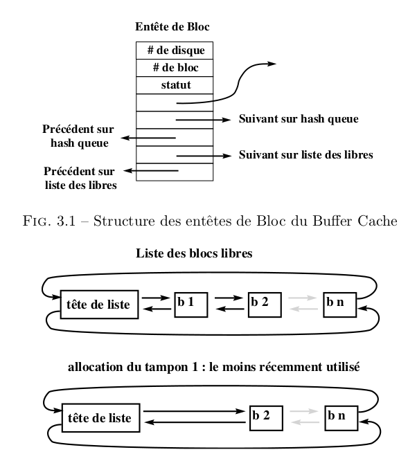

## Introduction au buffer cache

Le buffer cache est un ensemble de structures de données et d'algorithmes qui
permettent de minimiser le nombre des accès disque. C'est très important
car les disques sont très lents relativement au CPU : un noyau qui réaliserait
directement toutes les entrées-sorties serait d'une grande lenteur, et l'unité de
traitement ne serait effectivement utilisée qu'à un faible pourcentage. Deux
idées pour réduire le nombre des accès disques :

1. bufferiser les différentes commandes d'écriture et de lecture de façon à
   faire un accès disque uniquement pour une quantité de données de taille
   raisonnable ;
2. éviter des écritures inutiles quand les données peuvent encore être changées.

### Avantages et inconvénients du buffer cache

+ Un accès uniforme au disque. Le noyau n'a pas à connaître la raison de
  l'entrée-sortie. Il copie les données depuis et vers des tampons (que ce
  soient des données, des inodes ou le super bloc). Ce mécanisme est modulaire et
  s'intègre facilement à l'ensemble du système, qu'il rend plus facile à écrire.
+ Il rend l'utilisation des entrées-sorties plus simple pour l'utilisateur, qui
  n'a pas à se soucier des problèmes d'alignement, et rend les programmes
  portables sur d'autres UNIX.
+ Il réduit le trafic disque et, de ce fait, augmente la capacité du système.
+ L'implémentation du buffer cache protège contre certaines écritures
  concurrentes.
+ L'écriture différée pose un problème en cas de crash système : si la machine
  s'arrête alors que des blocs sont marqués « à écrire », ceux-ci n'ont pas été
  sauvegardés physiquement. L'intégrité des données n'est donc pas assurée en cas
  de crash (d'où les appels `sync`, `fsync` et l'option `O_SYNC`).
+ Le buffer cache nécessite une recopie supplémentaire (entre le tampon noyau et
  le tampon utilisateur) pour toute entrée-sortie. Dans le cas de transferts
  volumineux, ceci ralentit les entrées-sorties.

## Le buffer cache, structures de données

Le statut d'un bloc du cache est une combinaison des états suivants :

+ **verrouillé** : l'accès est réservé à un processus
+ **valide** : les données contenues dans le bloc sont valides
+ **à écrire** : les données du bloc doivent être écrites sur disque avant de
  réallouer le bloc
+ **actif** : le noyau est en train d'écrire/lire le bloc sur le disque
+ **attendu** : un processus attend la libération du bloc

### La liste doublement chaînée des blocs libres

Les tampons libres appartiennent simultanément à deux listes doublement
chaînées : la liste des blocs libres et la liste de hachage correspondant au
dernier bloc ayant été contenu dans ce tampon. L'insertion dans la liste des
tampons libres se fait en fin de liste, la suppression en début de liste : ainsi,
le tampon alloué est le plus anciennement libéré (politique LRU). Ceci permet une
réponse immédiate si le bloc correspondant est réutilisé avant que le tampon ne
soit alloué à un autre bloc.

