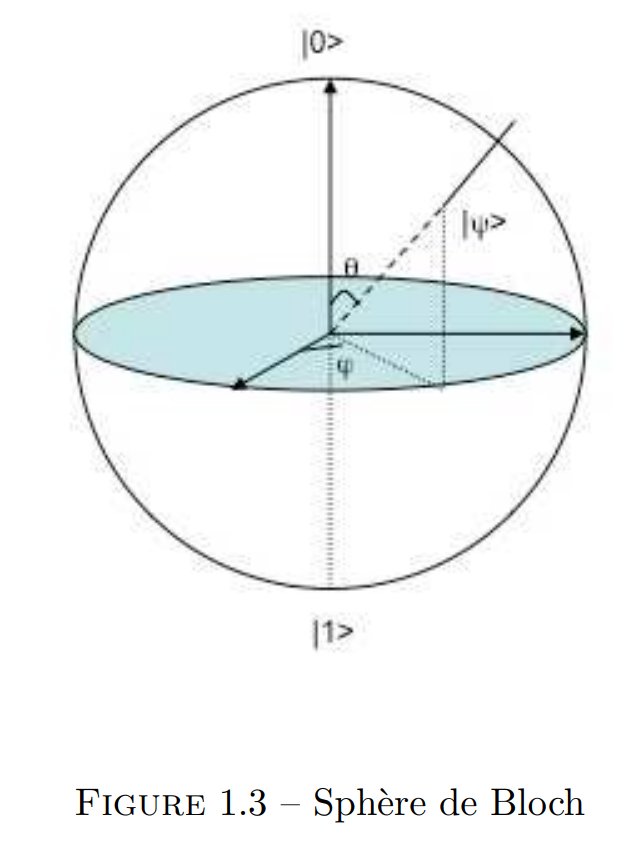

*Qu'est-ce que l'informatique quantique et le calcul quantique ?*

Le calcul quantique et l'informatique quantique sont l'étude du traitement de
l'information à l'aide de **systèmes quantiques**.

Un ordinateur quantique n'est pas simplement un ordinateur plus rapide : c'est
un ordinateur qui permet une nouvelle manière de concevoir les algorithmes, les
**algorithmes quantiques**.

L'ordinateur classique fonctionne sur le principe des bits (valeurs binaires 0
ou 1) ; la réalisation physique repose sur le courant électrique : si le
courant passe, l'information vaut 1, sinon elle vaut 0. On se base sur les
portes logiques (NOT, AND, XOR...), réalisées avec des transistors.

Entre le bit classique et le bit quantique, on peut définir le **bit
probabiliste** $(p,q)$ avec $p, q \in [0,1]$ tels que $p+q = 1$.

En revanche, un ordinateur quantique manipule des **bits quantiques** (ou
qubits) qui obéissent aux lois de la mécanique quantique.

## Principe de superposition

Un objet quantique peut se trouver dans une *superposition d'états* : il n'est
pas seulement soit dans l'état 0, soit dans l'état 1, il peut être dans une
superposition de ces deux états.

Exemple illustrant le principe de superposition : le chat de Schrödinger.

## Décohérence

Terme désignant le passage du monde quantique au monde classique. Plus un
système physique interagit avec son environnement, plus les effets quantiques
s'estompent.

## Représentation d'un qubit

On note $\vert \Psi \rangle$ un état d'un système quantique à 2 niveaux (tel
un qubit), décomposé sur la base $\{\vert 0 \rangle, \vert 1 \rangle\}$
(notation « ket ») :

$$\vert \Psi \rangle = \alpha \vert 0 \rangle + \beta \vert 1 \rangle$$

avec $\alpha, \beta \in \mathbb{C}$ et $\vert \alpha \vert^2 + \vert \beta \vert^2 = 1$.

Un nombre complexe est donné par un module et une phase.

## Sphère de Bloch

Avec le système de coordonnées sphériques :

$$
\begin{cases} x = \sin{\theta} \cos{\varphi} \\ y = \sin{\theta} \sin{\varphi} \\ z = \cos{\theta} \end{cases}
\qquad \theta \in [0,\pi],\ \varphi \in [0, 2\pi[
$$

Un facteur de phase global n'affectant pas l'état physique d'un système, nous
pouvons choisir $\alpha \in \mathbb{R}_+$ :

$$
\vert \Psi \rangle = \cos{\dfrac{\theta}{2}} \vert 0 \rangle + e^{i \varphi}
\sin{\dfrac{\theta}{2}} \vert 1\rangle
$$

## Exemples d'objets quantiques

### L'électron

Il possède une propriété quantique : le **spin**. Pour l'électron (spin 1/2),
il y a 2 possibilités lors d'une mesure selon un axe : spin up et spin down.
Le spin permet à l'électron de faire office de qubit : il peut être dans une
superposition de ces 2 états.

### Registres

Dans un ordinateur classique, on utilise des registres : par exemple, un
registre à 4 bits peut prendre 16 états possibles (un seul à la fois).

Dans un ordinateur quantique, on utilise un registre quantique : par exemple,
un registre à 4 qubits peut être dans une superposition des 16 états de base :

$$
\alpha_0 \vert 0000 \rangle + \alpha_1 \vert 0001 \rangle + \dots + \alpha_{15} \vert 1111 \rangle,
\qquad \sum_{k=0}^{15} \vert \alpha_k \vert^2 = 1
$$

## Portes quantiques

Elles permettent de manipuler des qubits, comme les portes logiques manipulent
des bits dans le monde classique.

Par exemple, la porte de **Hadamard** :

$$
\begin{cases} \vert 0 \rangle \stackrel{H}{\rightarrow} \dfrac{1}{\sqrt{2}} (\vert 0
\rangle + \vert 1 \rangle) \\ \vert 1 \rangle \stackrel{H}{\rightarrow}
\dfrac{1}{\sqrt{2}} (\vert 0 \rangle - \vert 1 \rangle) \end{cases}
$$

Il existe toute une zoologie de portes quantiques, qui prennent en entrée 1, 2,
... qubits.

Mathématiquement, on représente une porte quantique par une matrice unitaire
$U$. $U$ est une matrice carrée complexe ; elle est unitaire si (avec $U^+$ la
matrice transposée conjuguée, aussi notée $U^\dagger$) :

$$U U^+ = I = U^+ U$$

## Exemples de problèmes à résoudre

Soit $f : \{1,\dots,n\} \rightarrow \mathbb{N}$ donnée sous la forme d'un
tableau ; trouver $x$ tel que $f(x)=42$. Un algorithme classique effectue une
recherche exhaustive (complexité linéaire en $n$) ; en quantique, l'algorithme
de Grover résout ce problème avec $O(\sqrt{n})$ évaluations de $f$.

Autre exemple, la factorisation des nombres entiers : elle est simple lorsque
le nombre n'a que de petits facteurs premiers, mais la difficulté de factoriser
de grands nombres est à la base de cryptosystèmes comme RSA. En 1994, Peter Shor
a proposé un algorithme quantique de factorisation de complexité polynomiale,
alors que le meilleur algorithme classique connu (crible algébrique) est de
complexité sous-exponentielle mais super-polynomiale.

## Réalisation physique des qubits

Un ordinateur classique fonctionne grâce au courant électrique ; pour réaliser
un qubit, il faut un système physique suffisamment petit pour obéir aux lois de
la mécanique quantique.

Les objets permettant de réaliser physiquement un qubit peuvent être : le spin
de l'électron ou d'un noyau atomique, la polarisation d'un photon, des circuits
supraconducteurs, des atomes ou des ions piégés.

Cependant, il y a quelques complications techniques :

1. Il faut suffisamment de qubits pour avoir un registre quantique assez grand.
2. Les qubits doivent être isolés du monde extérieur pour être stables et
   rester dans un état superposé le plus longtemps possible, le temps
   d'effectuer les calculs.

## La suprématie quantique

Ce terme désigne la démonstration qu'un ordinateur quantique résout un problème
qu'aucun ordinateur classique ne peut résoudre en un temps raisonnable.

## Trois motivations pour l'étude de l'informatique quantique

1. La miniaturisation actuelle a déjà atteint des niveaux où les effets
   quantiques apparaissent.
2. Les effets quantiques permettent d'accélérer certains calculs et rendent
   réalisables en pratique des calculs hors de portée des ordinateurs
   classiques.
3. Le but de l'informatique théorique est d'étudier les pouvoirs et les limites
   des dispositifs de calcul les plus puissants que l'on puisse concevoir.

## Un peu d'histoire

- Début des années 1980 : Richard Feynman suggère l'intérêt d'un ordinateur
  quantique pour simuler les systèmes quantiques
- 1985 : David Deutsch définit la machine de Turing quantique universelle
- 1992 : algorithme de Deutsch-Jozsa, l'un des premiers algorithmes quantiques
- 1994 : algorithme quantique de factorisation de Peter Shor
- 1996 : algorithme de recherche de Lov Grover
- 2019 : Google annonce avoir atteint la suprématie quantique (processeur
  Sycamore)
