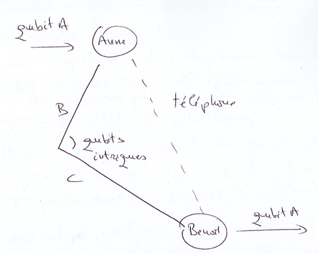

## Rappels : produit tensoriel de qubits

### Produit tensoriel et qubits

#### Représentation matricielle des qubits

$$\vert \psi \rangle = \alpha \vert 0 \rangle + \beta \vert 1 \rangle, \quad \vert \alpha \vert^2 + \vert \beta \vert^2 = 1$$

$$\vert \psi \rangle \rightarrow \begin{pmatrix} \alpha \\ \beta \end{pmatrix}$$

#### Cas particuliers

$\vert 0 \rangle \rightarrow \begin{pmatrix} 1 \\ 0 \end{pmatrix}$ et
$\vert 1 \rangle \rightarrow \begin{pmatrix} 0 \\ 1 \end{pmatrix}$

#### Produit tensoriel de matrices

Pour $A$ de taille $m \times n$ :

$$
A \otimes B := \begin{pmatrix}a_{11} B & a_{12} B & \cdots & a_{1n} B \\ a_{21}
B & a_{22} B & \cdots & a_{2n} B \\ \vdots & \vdots & \ddots & \vdots \\ a_{m1}
B & a_{m2} B & \cdots & a_{mn} B \end{pmatrix}
$$

#### Produit tensoriel de qubits - Exercice

Calculer les produits tensoriels des états $\vert 0 \rangle$ et
$\vert 1 \rangle$.

$$
\vert 00 \rangle \equiv \vert 0 \rangle \otimes \vert 0 \rangle =
\begin{pmatrix} 1 \\ 0 \end{pmatrix} \otimes \begin{pmatrix} 1 \\ 0
\end{pmatrix} = \begin{pmatrix} 1 \\ 0 \\ 0 \\ 0 \end{pmatrix}
\qquad
\vert 01 \rangle \equiv \vert 0 \rangle \otimes \vert 1 \rangle =
\begin{pmatrix} 1 \\ 0 \end{pmatrix} \otimes \begin{pmatrix} 0 \\ 1
\end{pmatrix} = \begin{pmatrix} 0 \\ 1 \\ 0 \\ 0 \end{pmatrix}
$$

$$
\vert 10 \rangle \equiv \vert 1 \rangle \otimes \vert 0 \rangle =
\begin{pmatrix} 0 \\ 1 \end{pmatrix} \otimes \begin{pmatrix} 1 \\ 0
\end{pmatrix} = \begin{pmatrix} 0 \\ 0 \\ 1 \\ 0 \end{pmatrix}
\qquad
\vert 11 \rangle \equiv \vert 1 \rangle \otimes \vert 1 \rangle =
\begin{pmatrix} 0 \\ 1 \end{pmatrix} \otimes \begin{pmatrix} 0 \\ 1
\end{pmatrix} = \begin{pmatrix} 0 \\ 0 \\ 0 \\ 1 \end{pmatrix}
$$

## L'intrication quantique

L'intrication quantique est un caractère subtil et paradoxal de la mécanique
quantique (paradoxe EPR).

### États à 2 qubits

Soit le qubit $A$, de base $\vert 0_A \rangle$, $\vert 1_A \rangle$, et le
qubit $B$, de base $\vert 0_B \rangle$, $\vert 1_B \rangle$. Les états de base
du système $AB$ sont
$\vert 0_A \rangle \vert 0_B \rangle, \vert 0_A \rangle \vert 1_B \rangle, \vert 1_A \rangle \vert 0_B \rangle, \vert 1_A \rangle \vert 1_B \rangle$.
Si chaque qubit se trouve dans un état de superposition :

+ qubit $A$ : $\vert \Psi_A \rangle = \alpha \vert 0_A \rangle + \beta \vert 1_A \rangle$
+ qubit $B$ : $\vert \Psi_B \rangle = \gamma \vert 0_B \rangle + \delta \vert 1_B \rangle$

alors l'état du système $AB$ est

$$
\vert \Psi_A \rangle \vert \Psi_B \rangle = \alpha \gamma \vert
0_A \rangle \vert 0_B \rangle + \alpha \delta \vert 0_A \rangle \vert 1_B
\rangle + \beta \gamma \vert 1_A \rangle \vert 0_B \rangle + \beta \delta \vert
1_A \rangle \vert 1_B \rangle
$$

Notation : $\vert 0_A 0_B \rangle \equiv \vert 00 \rangle$,
$\vert 0_A 1_B \rangle \equiv \vert 01 \rangle$,
$\vert 1_A 0_B \rangle \equiv \vert 10 \rangle$,
$\vert 1_A 1_B \rangle \equiv \vert 11 \rangle$.

La mécanique quantique nous dit (principe de superposition) que tout état à 2
qubits se décompose en

$$
\vert \psi \rangle = \alpha_{00} \vert 00 \rangle + \alpha_{01}\vert 01
\rangle + \alpha_{10} \vert 10 \rangle + \alpha_{11} \vert 11 \rangle \tag{2}
$$

avec
$\vert \alpha_{00} \vert^2 + \vert \alpha_{01} \vert^2 + \vert \alpha_{10} \vert^2 + \vert \alpha_{11} \vert^2 = \sum\limits_{i,j=0}^1 \vert \alpha_{ij} \vert^2 = 1$.

L'état $\vert \Psi_A \rangle \vert \Psi_B \rangle$
$(= \vert \Psi_A \rangle \otimes \vert \Psi_B \rangle)$ est un état factorisé.
Il existe des états qui ne se factorisent pas en un produit d'états à 1 qubit :
ce sont les **états intriqués**. Ce sont des états spécifiques de la
description quantique ; ils engendrent entre les particules des corrélations
fortes, qui sont à la base de différents protocoles et algorithmes de
l'informatique quantique.

**Important :** dans ces états, l'état individuel d'un qubit n'est pas défini ;
c'est le système qui est dans un état défini.

### Les états intriqués - 1er état de Bell

$$\vert \beta_{00} \rangle = \dfrac{1}{\sqrt{2}}(\vert 00 \rangle + \vert 11 \rangle)$$

Tant qu'aucune mesure n'est effectuée sur le système, l'état de chaque qubit
n'est pas défini. Si nous mesurons le 1er qubit et que nous trouvons l'état
$\vert 0 \rangle$, alors l'état $\vert \beta_{00} \rangle$ est projeté sur
l'état $\vert 00 \rangle$, ce qui entraîne que le 2e qubit est forcément lui
aussi dans l'état $\vert 0 \rangle$.

Montrons que $\vert \beta_{00} \rangle$ ne se factorise pas. On suppose qu'il
existe $\alpha_i, \beta_i$, $i = 0,1$, tels que

$$
\begin{aligned}
\vert \beta_{00} \rangle &= (\alpha_0 \vert 0 \rangle + \alpha_1 \vert 1 \rangle )(\beta_0 \vert 0 \rangle + \beta_1 \vert 1 \rangle) \\
&\Leftrightarrow \dfrac{1}{\sqrt{2}} \vert 00 \rangle + \dfrac{1}{\sqrt{2}} \vert 11 \rangle =
\alpha_0 \beta_0 \vert 00 \rangle + \alpha_0 \beta_1 \vert 01 \rangle + \alpha_1 \beta_0 \vert 10 \rangle + \alpha_1 \beta_1 \vert 11 \rangle \\
&\Rightarrow \alpha_0 \beta_0 = \dfrac{1}{\sqrt{2}} = \alpha_1 \beta_1
\Rightarrow \alpha_0, \beta_0, \alpha_1, \beta_1 \neq 0 \\
&\text{or } \alpha_0 \beta_1 = 0 = \alpha_1 \beta_0
\end{aligned}
$$

Cela conduit à une contradiction : l'état de Bell ne se factorise pas, c'est un
état intriqué.

### Mesure d'un état à 2 qubits

D'après le postulat de la mesure, si on mesure l'état de 2 qubits, le système
est projeté dans l'un des états de base $\vert 00 \rangle$, $\vert 01 \rangle$,
$\vert 10 \rangle$ ou $\vert 11 \rangle$, avec la probabilité
$\vert \alpha_{ij} \vert^2$.

#### Mesure partielle

On mesure uniquement un des 2 qubits : la mesure fixe l'état du qubit mesuré.
L'état du système devient une superposition des états de base compatibles, dans
laquelle le qubit mesuré a une valeur fixée.

Par exemple, si on mesure le 1er qubit du système dans l'état (2) et qu'on
trouve $\vert 0 \rangle$, le système est projeté dans l'état

$$
\vert \tilde{\Psi} \rangle = \dfrac{\alpha_{00}}{\sqrt{\vert \alpha_{00} \vert^2 + \vert \alpha_{01} \vert^2}} \vert 00 \rangle
+ \dfrac{\alpha_{01}}{\sqrt{\vert \alpha_{00} \vert^2 + \vert \alpha_{01} \vert^2}} \vert 01 \rangle
$$

## Téléportation quantique

On parle ici de la téléportation d'un état quantique, et non de la
téléportation du système physique porteur de cet état. Pour réaliser la
téléportation quantique, il faut une paire de particules intriquées. En
revanche, l'état initial, qui est téléporté, est détruit : cela est cohérent
avec le théorème de non-clonage (voir plus bas).

### Illustration

Comment transmettre d'un point $A$ à un point $B$ le contenu inconnu d'un
qubit (c'est-à-dire d'un état quantique), sans transporter le système physique
porteur du qubit ?

+ Anne (en $A$) et Benoît (en $B$) se sont partagé au préalable les 2 qubits
  d'un état intriqué de Bell $\vert \beta_{00} \rangle$.
+ Anne veut transmettre à Benoît le contenu d'un qubit dans un état
  $\vert \Psi \rangle = \alpha \vert 0 \rangle + \beta \vert 1 \rangle$
  qu'elle ne connaît pas.
+ Le système compte 3 qubits :
  $\vert \Psi_0 \rangle = \vert \Psi \rangle \vert \beta_{00} \rangle = \dfrac{1}{\sqrt{2}}(\alpha \vert 0 \rangle + \beta \vert 1 \rangle) (\vert 00 \rangle + \vert 11 \rangle) = \dfrac{1}{\sqrt{2}}\left[\alpha(\vert 000 \rangle + \vert 011 \rangle) + \beta (\vert 100 \rangle + \vert 111 \rangle)\right]$

Ordre des qubits :

1. A : le qubit inconnu (détenu par Anne)
2. B : le 1er qubit de la paire intriquée (détenu par Anne)
3. C : le 2nd qubit de la paire intriquée (détenu par Benoît)

Anne réalise les opérations suivantes :

1. Anne applique un CNOT sur la paire (A,B) (A contrôle, B cible) et obtient
   $\vert \Psi_1 \rangle = \dfrac{1}{\sqrt{2}} \left[\alpha (\vert 000 \rangle + \vert 011 \rangle) + \beta(\vert 110 \rangle + \vert 101 \rangle)\right]$
2. Anne envoie le qubit A sur une porte de Hadamard ; l'état du système
   devient

$$
\begin{aligned}
\vert \Psi_2 \rangle &= \dfrac{1}{2} \left[\alpha (\vert 000 \rangle + \vert 100 \rangle + \vert 011 \rangle + \vert 111 \rangle) + \beta (\vert 010 \rangle - \vert 110 \rangle + \vert 001 \rangle - \vert 101 \rangle)\right] \\
&= \dfrac{1}{2}\big(\vert 00 \rangle (\alpha \vert 0 \rangle + \beta \vert 1 \rangle) \\
&\quad + \vert 01 \rangle (\alpha \vert 1 \rangle + \beta \vert 0 \rangle) \\
&\quad + \vert 10 \rangle (\alpha \vert 0 \rangle - \beta \vert 1 \rangle) \\
&\quad + \vert 11 \rangle (\alpha \vert 1 \rangle - \beta \vert 0 \rangle)\big)
\end{aligned}
$$

L'état du qubit $C$ est complètement déterminé par celui de la paire $(A,B)$,
détenue par Anne : c'est un effet de la corrélation quantique due à
l'intrication de la paire $BC$.

3. Anne lit (mesure) la paire (A,B), obtient deux bits $b_1 b_2$ et transmet
   le résultat à Benoît par un canal classique (téléphone). La téléportation ne
   viole donc pas la relativité restreinte d'Einstein (aucune information ne
   peut être transmise plus vite que la lumière).
4. Benoît reçoit le résultat d'Anne et réalise sur le qubit C l'opération
   $Z^{b_1} X^{b_2}$. On peut vérifier que l'état résultant du qubit C est
   l'état $\vert \Psi \rangle$ !

   

## Théorème de non-clonage quantique

(Wootters et Zurek, *Nature*, 1982 ; Dieks, 1982)

Il est impossible de dupliquer un état quantique arbitraire inconnu.

On suppose, par l'absurde, qu'une telle « machine » existe, décrite par un
opérateur unitaire $U$. Soit $\vert \psi \rangle$ l'état à photocopier et
$\vert b \rangle$ l'état initial (normalisé) du qubit de copie. Le clonage
consiste à réaliser l'opération suivante :

$$\vert \psi \rangle \vert b \rangle \stackrel{U}{\longrightarrow} \vert \psi \rangle \vert \psi \rangle$$

Soit $\vert \phi \rangle$ un autre état à cloner, $\vert \phi \rangle \neq
\vert \psi \rangle$ : on a aussi $U \vert \phi \rangle \vert b \rangle = \vert
\phi \rangle \vert \phi \rangle$. En faisant le produit scalaire de ces deux
égalités :

$$
\begin{aligned}
\langle \phi \vert \langle \phi \vert \, \vert \psi \rangle \vert \psi \rangle &= \langle \phi \vert \langle b \vert \, U^+ U \, \vert \psi \rangle \vert b \rangle \\
\Rightarrow (\langle \phi \vert \psi \rangle)^2 &= \langle \phi \vert \psi \rangle \langle b \vert b \rangle = \langle \phi \vert \psi \rangle \\
\Rightarrow \langle \phi \vert \psi \rangle &\in \{0, 1\}
\end{aligned}
$$

Donc soit $\langle \phi \vert \psi \rangle = 1$, c'est-à-dire que les deux
états sont identiques (contradiction), soit $\langle \phi \vert \psi \rangle = 0$,
c'est-à-dire que les états sont orthogonaux. Une telle machine ne peut donc
cloner que les états d'une famille orthogonale fixée, et non un état
quelconque : il est impossible de cloner des états quantiques arbitraires.

## Manipulation d'états à 2 qubits - Calcul quantique

Les opérations sur 1 ou plusieurs qubits correspondent à l'action d'opérateurs
unitaires, donc à des évolutions réversibles (différence fondamentale avec les
ordinateurs classiques, dont les évolutions sont irréversibles). Dans le monde
classique, on a le théorème suivant : toute porte logique peut être construite
à partir de NAND et COPY. NAND et COPY ne peuvent pas être transposées dans le
monde quantique, à cause de l'irréversibilité (NAND) et du théorème de
non-clonage (COPY). Cependant, il est possible de transformer les algorithmes
classiques irréversibles en algorithmes réversibles.

Cela a toutefois un coût :

+ augmentation du volume d'information traitée ;
+ introduction d'une nouvelle porte à 3 bits, TOF (porte de Toffoli) :

$$(x,y,z) \longrightarrow (x,y, z \oplus x y)$$

On dit qu'une fonction $f : \mathbb{B}^n \rightarrow \mathbb{B}^n$ est
calculable « avec variables auxiliaires » sur l'ensemble de portes
(réversibles) $\mathcal{G}$ si et seulement s'il existe un circuit
$\mathcal{C}$ à $(n+m)$ entrées tel que

$$\mathcal{C}(\vec{x},0^m) = (f(\vec{x}),0^m)$$

c'est-à-dire que le circuit $\mathcal{C}$ se sert des $m$ dernières places pour
calculer, mais n'y prend aucune donnée et n'y retourne aucun résultat.

$$f_{\oplus}(\vec{x},y) := (\vec{x},y \oplus f(\vec{x}))$$

On peut montrer que tout circuit irréversible calculant une fonction $f$ peut
être transformé en un circuit réversible, avec variables auxiliaires,
calculant $f_{\oplus}$. Grâce à cette équivalence, on peut associer un
algorithme quantique réversible à tout algorithme classique irréversible.

## Théorème de Bennett, Landauer et Toffoli

Soit $n \geq 2$. Toute application booléenne inversible

$$f : \mathbb{B}^n \rightarrow \mathbb{B}^n$$

est calculable par un circuit avec variables auxiliaires sur l'ensemble de
portes {NOT, SWAP, TOF}. La porte NOT peut être remplacée par la porte cNOT
(NOT contrôlé) :

| Entrée | Sortie |
|:-------|:-------|
| 00     | 00     |
| 01     | 01     |
| 10     | 11     |
| 11     | 10     |

Le 1er bit est le bit de contrôle : sa valeur est inchangée. Le deuxième bit
est le bit cible : sa valeur est inchangée si le bit de contrôle vaut 0, et
inversée si le bit de contrôle vaut 1.

Le cNOT quantique est représenté par la matrice suivante dans la base
$\vert 00 \rangle, \vert 01 \rangle, \vert 10 \rangle, \vert 11 \rangle$ :

$$
\mathrm{CNOT} = \begin{pmatrix} 1 & 0 & 0 & 0 \\ 0 & 1 & 0 & 0 \\ 0 & 0 & 0 & 1 \\ 0 & 0 & 1 & 0 \end{pmatrix}
$$

## Théorème de Kitaev-Shen-Vyalyi

Soit $n \geq 2$, $N = 2^n$. Toute matrice unitaire
$U_N \in \mathcal{M}_{N}(\mathbb{C})$, vue comme une porte à $n$ qubits, est
réalisable par un circuit sur l'ensemble de portes

$$
\{\mathrm{NOT}, \mathrm{SWAP}, \mathrm{TOF}\} \cup \{\Lambda (U) \mid U \text{ unitaire de taille } 2 \}
$$

où $\Lambda(U)$ désigne la porte $U$ contrôlée par un autre qubit. Autrement
dit, les portes réversibles de base (traduites en transformations unitaires),
ainsi que toutes les portes à 1 qubit contrôlées par un autre qubit, suffisent
pour réaliser n'importe quelle transformation unitaire sur $n$ qubits.
