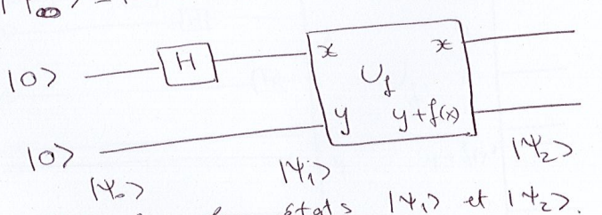
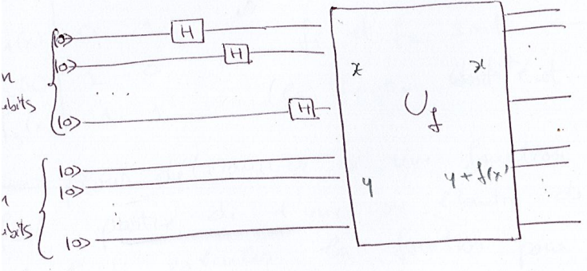

## Ordinateur classique vs ordinateur quantique

On peut schématiser un ordinateur classique à l'aide de 3 composants :

1. des registres (qui contiennent les données à traiter) ;
2. une unité de calcul (qui transforme les données suivant un algorithme défini
   en actionnant des portes logiques) ;
3. une unité d'entrées/sorties (qui initialise les registres au début du
   traitement et lit les résultats à la fin).

### Les registres

+ Un registre classique est un ensemble de $n$ bits permettant de stocker l'un
  des $m=2^n$ entiers compris entre 0 et $2^n-1$.
+ Un registre quantique est un système quantique de $n$ qubits dont les états
  sont les éléments d'un espace des états de dimension $m=2^n$. On définit dans
  cet espace la base
  $\vert j_1,j_2,\dots,j_n \rangle := \vert j_1 \rangle \vert j_2 \rangle \dots \vert j_n \rangle$.

Chaque vecteur de base peut être désigné :

1. par la liste des états de chaque qubit, éléments de
   $\mathbb{Z}_2 = \{0,1\}$ : $\vert j_1 j_2 \dots j_n \rangle$ ;
2. par le nombre entier $j$, $0 \leq j \leq 2^n-1$, dont $(j_1,j_2,\dots,j_n)$
   constitue la décomposition binaire : $j=j_1 2^{n-1} + \dots + j_n$.

$\mathbb{Z}_M$ est l'ensemble des entiers modulo $M$ ; avec $M = 2^n$ :

$$
\begin{aligned}
j \in \mathbb{Z}_M &\Leftrightarrow (j_1,j_2,\dots,j_n) \in \mathbb{Z}^n_2 \\
j &= j_1 2^{n-1} + j_2 2^{n-2} + \dots + j_n 2^0
\end{aligned}
$$

### Spécificité des registres quantiques

Les registres quantiques peuvent se trouver non seulement dans un des états de
la base (comme le registre classique), mais aussi dans un état de
superposition :

$$\vert \psi \rangle = \sum_{x=0}^{N-1} \alpha_x \vert x \rangle, \qquad N = 2^n, \quad \sum_{x=0}^{N-1} \vert \alpha_x \vert^2 = 1$$

Les algorithmes quantiques sont représentés par l'évolution d'un ou plusieurs
registres sous l'effet de l'application d'opérateurs unitaires. L'état de
l'ordinateur peut comprendre plusieurs registres.

## Les entrées / sorties

L'entrée consiste à mettre le système quantique, constitué par les registres,
dans un état initial : on dit qu'on prépare le système. Le plus souvent, les
différents registres sont initialement dans l'état $\vert 0 \rangle$, et la
préparation consiste à faire agir différents opérateurs, comme la
transformation de Hadamard.

La sortie correspond à la lecture d'un registre, c'est-à-dire à la mesure de
l'état quantique final du registre. D'après le postulat de la mesure, celle-ci
modifie de façon irréversible l'état du registre, qui est projeté sur l'un des
états de la base. En général, les algorithmes quantiques utilisent des mesures
partielles de l'état final (mesure d'un seul des registres, voire de quelques
qubits d'un registre).

## Parallélisme quantique

Souvent, on a besoin d'évaluer une fonction

$$f : \mathbb{Z}^n_2 \rightarrow \mathbb{Z}^m_2$$

qu'on ne peut pas toujours représenter directement par un opérateur unitaire
(elle n'est pas forcément injective). Pour associer un opérateur unitaire à
l'évaluation d'une fonction, on définit :

+ un registre de données $\vert x \rangle$ à $n$ qubits, $x \in \mathbb{Z}_{2^n}$,
  qui contient la valeur de la variable ;
+ un registre de résultats $\vert y \rangle$ à $m$ qubits,
  $y\in \mathbb{Z}_{2^m}$, qui contient le résultat ;
+ un opérateur unitaire
  $U_f \vert x \rangle \vert y \rangle = \vert x \rangle \vert y \oplus f(x) \rangle$.

Le parallélisme est un trait de beaucoup d'algorithmes quantiques : une
fonction $f(x)$ peut être évaluée simultanément en plusieurs valeurs de $x$
(conséquence de la superposition des états de qubits).

### Exemple

Soit un registre de données et un registre de résultats, chacun à 1 qubit. La
valeur initiale de chaque registre est $\vert 0 \rangle$.

Exercice : calculer les états $\vert \Psi_1 \rangle$ et $\vert \Psi_2 \rangle$.

On applique la porte de Hadamard au seul qubit de données :

$$
\vert \Psi_1 \rangle = (H \otimes I) \vert 00 \rangle = \dfrac{1}{\sqrt{2}}(\vert 00 \rangle + \vert 10 \rangle)
$$

L'état de sortie est

$$
\vert \Psi_2 \rangle = U_f \vert \Psi_1 \rangle = \dfrac{1}{\sqrt{2}}(\vert 0, f(0)\rangle + \vert 1, f(1)\rangle)
$$

Il contient à la fois $f(0)$ et $f(1)$, obtenus par une seule application de la
porte $U_f$.

### Généralisation

Soit un registre à $n$ qubits (registre de données). La transformation de
Hadamard appliquée à chaque qubit de l'état $\vert 0 \dots 0 \rangle$ donne
pour le registre de données

$$
\dfrac{1}{\sqrt{2^n}} \sum_{x=0}^{2^n-1} \vert x \rangle = \dfrac{1}{\sqrt{2^n}}(\vert 00\dots0 \rangle + \vert
00\dots01\rangle + \dots + \vert 11\dots11 \rangle)
$$

L'état de sortie est

$$
\dfrac{1}{\sqrt{2^n}} \sum_{x=0}^{2^n-1} \vert x \rangle \vert 0 \oplus
f(x) \rangle = \dfrac{1}{\sqrt{2^n}} \sum_{x=0}^{2^n-1}\vert x \rangle
\vert f(x) \rangle
$$

Cela fait apparaître toutes les valeurs de $f$ en une seule opération : c'est
le parallélisme quantique. Une mesure ne permet cependant d'en lire qu'une
seule ; tout l'enjeu des algorithmes quantiques est d'exploiter les
interférences pour extraire une propriété globale de $f$.

## Algorithme de Deutsch (1985) et problème de Deutsch-Jozsa (1992)

L'algorithme de Deutsch (1985) traite le cas d'une fonction
$f : \{0,1\} \rightarrow \{0,1\}$ ; l'algorithme de Deutsch-Jozsa, proposé par
David Deutsch et Richard Jozsa en 1992, le généralise. Dans le problème de
Deutsch-Jozsa, nous disposons d'une boîte noire quantique, appelée oracle, qui
implémente une fonction mathématique $f : \{0,1\}^n \rightarrow \{0,1\}$. Nous
savons que cette fonction est soit constante (la sortie est 0 pour toutes les
entrées, ou 1 pour toutes les entrées), soit équilibrée (la sortie est 0 pour
la moitié des entrées et 1 pour l'autre moitié). Le but est de déterminer si la
fonction est constante ou équilibrée à l'aide de l'oracle.

Un algorithme classique déterministe nécessite, dans le pire cas,
$2^{n-1}+1$ appels à l'oracle ; l'algorithme de Deutsch-Jozsa conclut avec
certitude en un seul appel à $U_f$.
