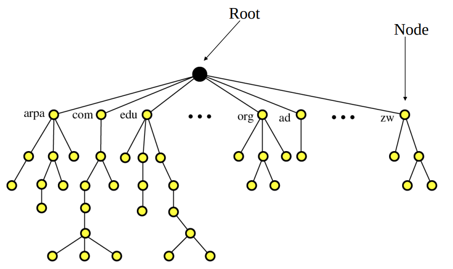
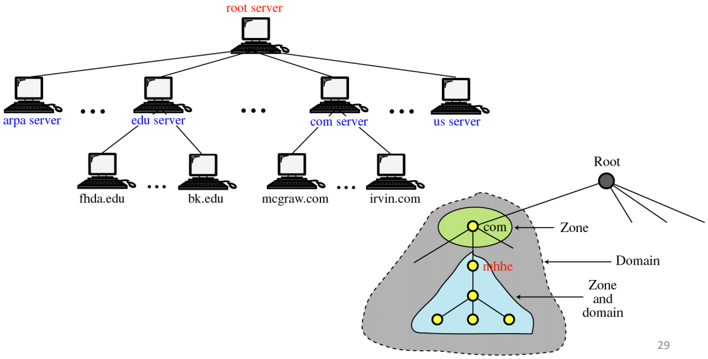
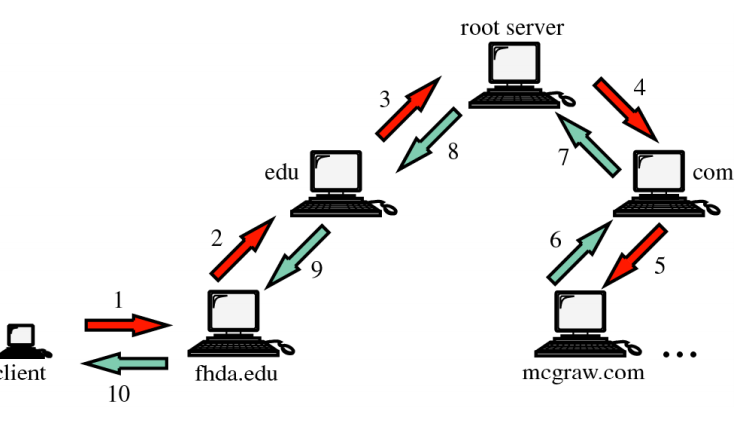

Le DNS est utilisé pour la résolution de noms. L'**adresse IP** d'une entité réseau est :

+ un identificateur utile au traitement des informations (datagrammes IP) par le
  réseau ;
+ peu pratique à manipuler pour les utilisateurs : 32 bits pour IPv4, 128 bits
  pour IPv6 ;
+ calquée sur la structure logique du réseau (adressage, sous-adressage,
  etc.), mais rarement sur la structure humaine de l'organisation utilisant ce
  réseau.

Le **nom d'une entité réseau** est défini par :

+ une chaîne de caractères significative pour les utilisateurs ;
+ pouvant ou devant respecter des conventions pour le bon fonctionnement d'un
  réseau particulier, voire d'Internet.

La mise en correspondance d'un nom et d'une adresse IP est ce que l'on appelle la **résolution de noms**.

Le nommage des hôtes est coordonné par une organisation mondiale de gestion
des noms, indispensable pour les hôtes participant à
Internet : l'ICANN (*Internet Corporation for Assigned Names and Numbers*). L'ICANN
est chargée d'allouer l'espace des adresses de protocole internet (IP),
d'attribuer les identificateurs de protocole, de gérer le système des noms de
domaine de premier niveau, etc.

Le système de noms de domaine (DNS) exploite le mode de nommage hiérarchique des
entités réseau internet.

## Noms de domaine

Un nom est une suite d'étiquettes (labels) séparées par des points, de niveau hiérarchique croissant de gauche à droite : le label à droite du
point le plus à droite est appelé domaine de premier niveau (TLD). Toute suite de labels formant un suffixe du nom est un **nom de domaine**.

Les noms de domaine peuvent contenir des caractères Unicode : ce sont les noms
de domaine internationalisés (*Internationalized Domain Names*, IDN). La syntaxe
des noms de domaine ne permet pas de distinguer un hôte particulier d'un
ensemble d'hôtes, la structure hiérarchique est organisée en arbre correspondant
au schéma de la délégation des responsabilités d'administration des noms. Le nom
de domaine peut donc être associé à

+ un hôte (une adresse IP) ;
+ une zone de courrier électronique, c'est-à-dire un serveur de courrier
  électronique ;
+ une zone de responsabilité d'administration.

## Hiérarchie du DNS et sa structure arborescente

## Principe de la résolution de noms

Le but de la résolution de noms est d'obtenir l'adresse IP associée à un
nom de domaine. Pour ce faire, on utilise un système client-serveur distribué :

+ client : solveur de noms (*resolver*) ;
+ serveur : serveur de noms.

Cela est possible via l'utilisation d'un ensemble hiérarchisé de serveurs de
noms communiquant par un réseau TCP/IP.

Les solveurs et serveurs de noms peuvent gérer des caches contenant des entrées
à durée de vie limitée (TTL). La fraîcheur des réponses est indiquée au client. En
principe, un solveur s'adresse au serveur de noms de son domaine. Un serveur de
noms qui n'est pas capable de répondre à une requête s'adresse :

+ à un autre serveur de noms ;
+ ou au serveur racine.

Deux modes existent : en résolution **récursive**, le serveur interrogé mène lui-même toute la recherche et renvoie la réponse finale ; en résolution **itérative**, il renvoie seulement l'adresse du serveur suivant à interroger (référence), et c'est le demandeur qui poursuit.

## Ressources DNS

+ Chaque nœud de l'arbre contient une ou plusieurs ressources
+ Une ressource est principalement constituée de :
  + un type qui indique comment interpréter les données associées
  + une durée de validité (TTL)
  + un objet associé au nom pointé dans l'arbre
+ Type ou enregistrement DNS
  + A : adresse IPv4
  + AAAA : adresse IPv6
  + CNAME : nom canonique, il permet de faire correspondre un alias au nom
    canonique
  + MX : liste des serveurs de courrier électronique et préférences
  + NS : nom du serveur de noms responsable du domaine
  + SOA (*Start of Authority*) : description de la zone de responsabilité : serveur de noms ayant autorité sur la zone, contact, numéro de série et temporisations
  + PTR : pointeur vers un nom de domaine (utilisé pour la résolution inverse)
  + SRV : localisation d'un service (nom de machine + numéro de port)
  + TXT : zone de texte libre

### Zone d'autorité

Un serveur de noms définit une zone, c'est-à-dire un ensemble de domaines sur
lequel le serveur a autorité. Par exemple, le serveur DNS de l'ENSEIRB a
autorité sur le domaine enseirb-matmeca.fr. Plusieurs serveurs peuvent partager
cette autorité, sans forcément faire partie de ce domaine.

## Résolution inverse

Le DNS permet la conversion inverse : adresse vers nom. Il s'agit par exemple de
retrouver le nom associé à l'adresse IP 209.85.229.104 (à l'époque, un serveur de Google). Le DNS
maintient pour cela un sous-arbre particulier sous la zone `in-addr.arpa` (`ip6.arpa` pour IPv6), dans lequel les octets de l'adresse sont inversés : 104.229.85.209.in-addr.arpa, avec un enregistrement PTR.

## Configuration des indications de racine

Lorsque le serveur DNS n'est pas configuré pour utiliser des redirecteurs, il se
sert des **indications de racine** pour résoudre les noms d'hôtes ou les adresses
IP appartenant à des zones qu'il n'héberge pas. Les indications de racine sont
un ensemble de serveurs hébergeant la zone contenant les enregistrements **du
domaine racine** (domaine « . »). Les "serveurs DNS racines" correspondent à 13 identités (lettres A à M), chacune servie par de nombreuses instances réparties dans le monde (anycast). Ils appartiennent tous à un même domaine nommé
*root-servers.net*.

## Configuration des redirecteurs

Lorsque le serveur DNS n'est pas capable de résoudre un nom en adresse IP, il va
essayer de contacter un autre serveur DNS, le DNS redirecteur. Il est possible
de configurer un ou plusieurs redirecteurs pour un domaine précis. L'utilisation
des redirecteurs permet d'utiliser des serveurs DNS locaux pour résoudre les
enregistrements de ressources des domaines locaux et des serveurs DNS extérieurs
pour résoudre les enregistrements de ressources des domaines internet.
