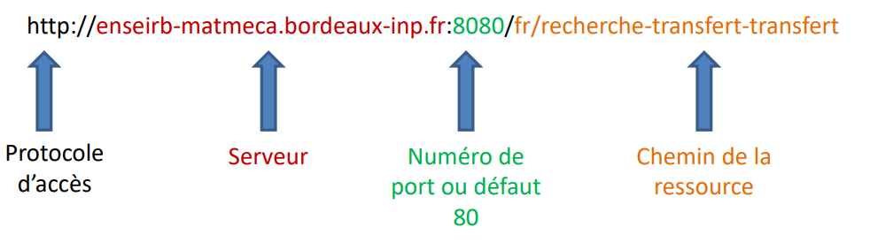
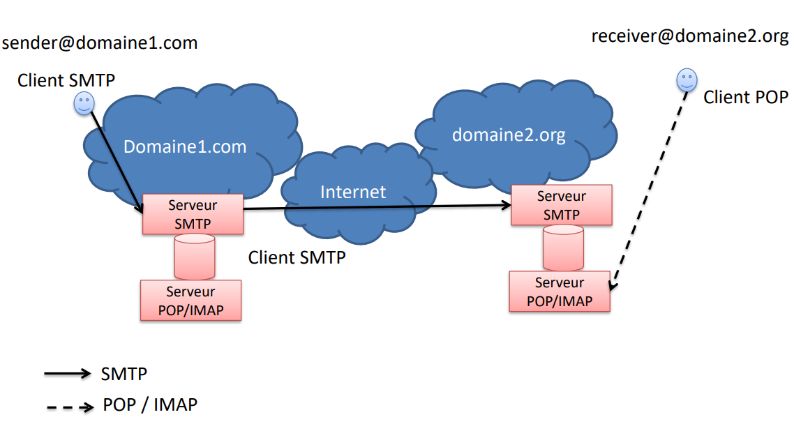

## Le protocole HTTP

HTTP (Hypertext Transfer Protocol) est un protocole de transfert de différents
formats de données entre serveur et client : texte, images, vidéo, etc.

Le protocole HTTP est basé sur le principe de requête-réponse. Le client HTTP
réalise les opérations suivantes :

+ Établissement d'une connexion TCP vers un serveur identifié par une adresse IP
  et un numéro de port (par défaut 80, 443 pour HTTPS)
+ Transmission d'une requête sous la forme d'une méthode suivie d'une URI et du
  numéro de version, puis d'en-têtes (nature et format du document accepté ou envoyé, type
  MIME, informations sur le client) et éventuellement d'un corps.

Le serveur répond par une ligne d'état, incluant la version de protocole et un
message de succès ou d'erreur, suivi de métadonnées (type MIME, taille de la
réponse, etc.) et éventuellement le corps de la réponse.

## Le courrier électronique

Les protocoles de messagerie électronique sont répartis en deux catégories :
l'émission (SMTP) et la réception (POP, IMAP).

### Le protocole SMTP

Le protocole SMTP fonctionne en mode client / serveur avec des requêtes envoyées
par le client, auxquelles le serveur doit répondre. Une **requête** est une
commande texte terminée par la séquence `<CRLF>` (retour chariot et saut de ligne). La **réponse** est un code numérique
sur 3 caractères et un message de description.

Les différentes requêtes SMTP :

+ HELO pour s'identifier auprès du serveur SMTP. Depuis avril 2001 (RFC 2821), la commande
  EHLO (SMTP étendu) doit être préférée à HELO
+ MAIL FROM indique l'adresse de l'émetteur du message
+ RCPT TO indique l'adresse du destinataire
+ DATA transmet le corps du message et les fichiers attachés, codés en ASCII 7 bits (encodage MIME)
+ QUIT termine la session en cours

### Le protocole POP3

Le protocole POP permet de récupérer un courrier sur un serveur POP. Les courriels
arrivent généralement pendant que le client est déconnecté et sont enregistrés sur le système de
fichiers du serveur POP, jusqu'à leur récupération. La version la plus utilisée est POP3.

Le protocole POP fonctionne en mode client / serveur, avec des requêtes envoyées
par le client auxquelles le serveur doit répondre.

Les différentes commandes POP3 :

+ `USER identifiant` : pour s'authentifier. Elle doit être suivie du nom de
  l'utilisateur, c'est-à-dire une chaîne de caractères identifiant l'utilisateur
  sur le serveur.
+ `PASS mot_de_passe` : permet d'indiquer le mot de passe de l'utilisateur
+ `STAT` : informations sur les messages contenus sur le serveur
+ `RETR n` : récupère le message numéro `n`
+ `DELE n` : marque le message numéro `n` pour suppression
