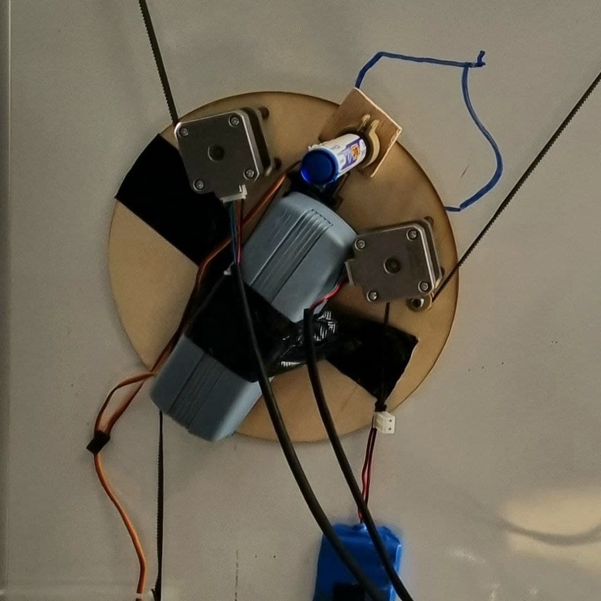
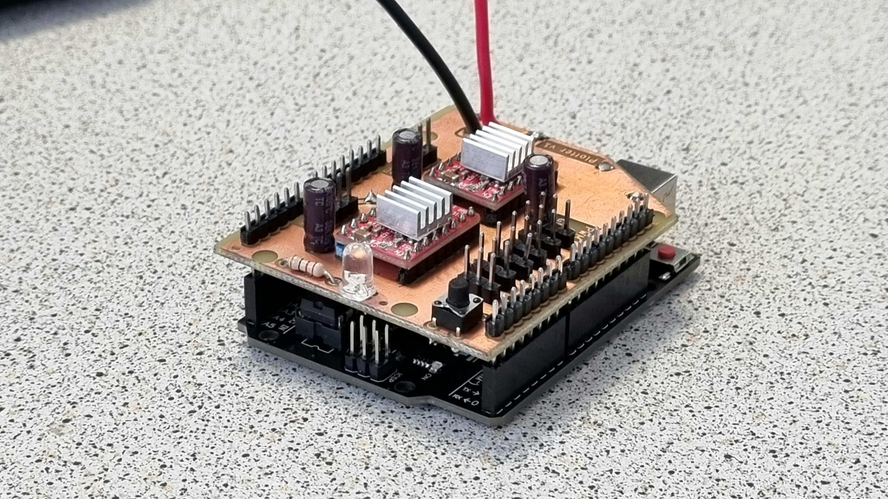
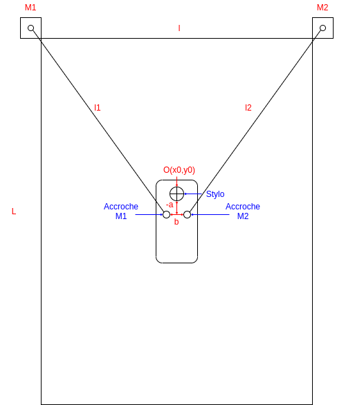
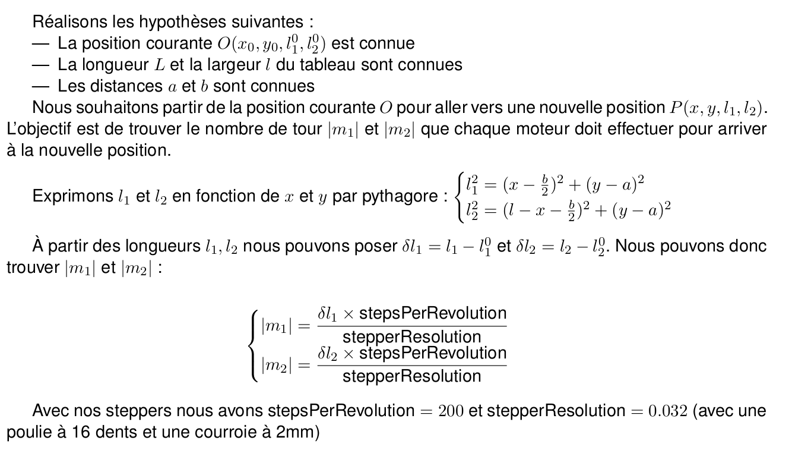
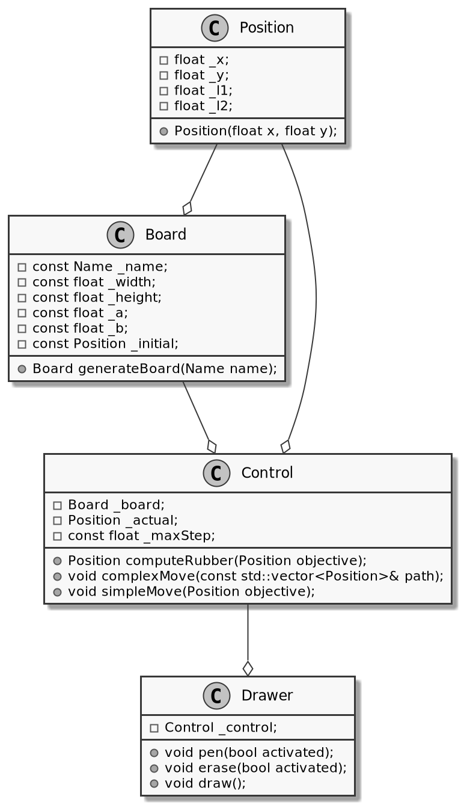

## 1. Présentation du projet

Un plotter est un mécanisme d'impression permettant d'effectuer des tracés sur un support à partir d'un fichier (.svg par exemple). L'objectif de ce projet est de réaliser un plotter vertical sur l'un des tableaux blancs d'EirLab, permettant de dessiner et d'effacer ses dessins en boucle.

<ResourceList type="support" title="Présentations du projet" ordered>

- [Slides de présentation du projet](http://www.eirlab.fr/tiki-download_file.php?fileId=285&display=y)
- [Slides de présentation de mi-parcours](http://www.eirlab.fr/tiki-download_file.php?fileId=287&display=y)
- [Slides de présentation de fin de projet](http://www.eirlab.fr/tiki-download_file.php?fileId=350&display=y)

</ResourceList>

### État de l'art

Des centaines de projets de plotters existent sur Thingiverse, Instructables, etc. Nous pouvons citer, parmi les différents projets, deux qui ont retenu notre attention et qui nous ont permis de nous familiariser avec les différentes technologies pouvant être utilisées pour réaliser un plotter vertical :

1. [Thingiverse](https://www.thingiverse.com/thing:2349232)
2. [Instructables](https://www.instructables.com/ARDUINO-POLAR-V-PLOTTER/)

### Matériel nécessaire

* Carte Arduino (Uno)
* Drivers de moteurs pas à pas ([A4988](https://components101.com/modules/a4988-stepper-motor-driver-module))
* Moteurs pas à pas ([42SHD0034-20B](https://www.geeetech.com/hybrid-stepper-motor-42shd003420b-for-3d-printer-p-1011.html)) x2
* Poulies 16 dents x2
* Mini servomoteur MG90S x1
* Courroie en caoutchouc (2 mm)
* Stylo pour tableau blanc

## 2. Mécanique

Pour la mécanique du projet, nous avons réalisé deux versions. Nous nous sommes rendu compte que la première possédait des défauts intrinsèques qui rendaient son utilisation impossible ; nous avons donc changé complètement la mécanique à mi-projet pour une version moins esthétique mais fonctionnelle.

### Première version : centralisation

Jusqu'à la moitié du projet, nous avons cherché à centraliser toute l'électronique dans le cœur de la machine. Nous voulions que le shield, les moteurs pas à pas et les mécanismes de levée du stylo ou de la brosse se trouvent au même endroit, dans la partie mobile. L'idée était de n'avoir qu'un câble d'alimentation apparent en mettant tous les composants électroniques au centre.

Nous avons donc commencé par modéliser notre plotter en 3D, sur SolidWorks.

Une fois le modèle réalisé, nous avons imprimé les pièces 3D complexes (la pièce serrant le stylo en place et les roues pour la courroie en caoutchouc) et découpé les autres pièces à la découpeuse laser.

Entre-temps, l'électronique avait bien avancé et nous pouvions lancer nos premiers tests. Voici une vidéo d'un des tests réalisés sur la version 1 de notre plotter :

[Vidéo de démonstration](http://www.eirlab.fr/tiki-download_file.php?fileId=329&display=y)

On se rend compte que le centre de gravité de la partie mobile est bien trop en arrière, ce qui fait pencher considérablement notre tête et empêche le stylo d'écrire.

Nous avons réfléchi aux solutions qui se présentaient à nous :

* Descendre les moteurs n'allait pas résoudre notre problème, juste changer l'angle d'inclinaison, mais pas suffisamment pour que la pointe du stylo touche le tableau.
* Utiliser des câbles pour pouvoir plaquer plus facilement la tête contre le tableau, comme le montre une [vidéo](https://youtu.be/QYwWyuI_DsA?t=109) de présentation de Scribit, un plotter vertical commercialisé. Nous avions des craintes concernant la précision des déplacements avec l'utilisation des câbles : un tour de moteur ne correspond pas à la même longueur de câble tirée selon que l'axe est vide ou que le câble y est déjà enroulé d'une trentaine de tours.
* Refaire totalement la mécanique et enlever les moteurs du cœur de la machine. C'est la solution pour laquelle nous avons opté.

### Deuxième version

Nous avons enlevé du cœur de la machine les moteurs, mais aussi le shield. Seuls les mécanismes de levée du stylo et de la brosse restent au centre du plotter.

Voici le nouveau modèle 3D : [vidéo](http://www.eirlab.fr/tiki-download_file.php?fileId=323&display=y)

Une fois les pièces imprimées et découpées, nous avons fait l'assemblage et avons bien observé que notre problème de centre de gravité n'apparaissait plus.

Voici une liste des différents avantages et inconvénients de ce nouveau modèle.

#### Avantages

* Pas de bascule à cause d'un poids trop important
* Plus esthétique, avec un cœur en forme du logo d'EirLab

#### Inconvénients

* Une partie de l'électronique se trouve hors du cœur : des câbles se baladent.

Nous avons ensuite ajouté un petit boîtier pour intégrer la carte Arduino.

Les différents fichiers permettant de reproduire la mécanique du projet sont disponibles [ici](https://github.com/Sdelpeuch/MakerPlotter) (utilisation d'une découpeuse laser et d'une imprimante 3D).

## 3. Électronique

Notre projet implique le contrôle de différents modules à différentes tensions. Nous devons principalement contrôler les deux moteurs pas à pas qui permettent de faire bouger notre module sur le tableau. Ces moteurs sont contrôlés par deux drivers ([A4988](https://components101.com/modules/a4988-stepper-motor-driver-module)). Chaque driver nécessite une entrée 5 V, une masse et deux connexions avec des broches numériques de l'Arduino (pour contrôler la direction et le nombre de pas). Chaque driver nécessite de plus une alimentation comprise entre 8 V et 12 V pour alimenter les moteurs (la plage admise par l'A4988 va de 8 V à 35 V).

De plus, pour monter et descendre le stylo et la brosse, nous utilisons des servomoteurs : il est donc nécessaire d'avoir plusieurs sorties 5 V, GND et PWM pour les contrôler.

Pour éviter l'utilisation abusive de câbles Dupont partant de l'Arduino, nous avons opté pour la création d'un shield sur mesure. Ce shield comprend 6 sorties pour servomoteurs (5 V + GND + PWM), des emplacements pour les drivers ainsi que des connecteurs mâles pour accueillir les connecteurs des moteurs. Nous avons ajouté une LED et un bouton au cas où.

L'alimentation de l'ensemble se fait via le shield, grâce à un transformateur branché sur le secteur (230 V). Sur la photo ci-dessous, le connecteur d'alimentation n'est pas encore installé.

:::danger

Ne jamais brancher le port USB et l'alimentation via le shield en même temps.

:::

Lorsque l'on alimente une Arduino par l'extérieur (utilisation de la broche Vin), le régulateur de tension s'assure que l'Arduino n'est pas alimentée à plus de 5 V. Cela nous permet d'alimenter l'ensemble en 10 V tout en sachant que l'Arduino sera alimentée en 5 V. Sur une Arduino Uno d'origine, si la carte est alimentée à la fois via son port USB type B et par sa broche Vin, un circuit de sélection isole l'alimentation USB et la carte fonctionne normalement.

Cependant, nous n'utilisons pas une Arduino Uno mais une copie (Joy-it R3DIP), dont le circuit d'alimentation n'est pas le même. Ainsi, si la carte est alimentée à la fois par le shield et par son port USB type B, la régulation à 5 V n'est plus assurée sur la carte et celle-ci est soumise à une tension égale à Vin (soit 10 V dans notre cas), ce qui a pour effet de rendre hors service l'ATmega.

L'alimentation se fait via le shield grâce à un transformateur trouvé à EirLab, qui se branche sur une prise conventionnelle et délivre une tension continue en sortie.

Les éléments pour reproduire le shield sont disponibles
[ici](http://www.eirlab.fr/tiki-download_file.php?fileId=290).

## 4. Logiciel

### 4.1. Mathématiques

Pour réussir à dessiner, la première étape est de trouver les équations mathématiques permettant de convertir un déplacement en un nombre de tours pour chaque moteur. Pour ce faire, commençons par définir le problème.

### 4.2. Programme

Maintenant que nous avons à notre disposition tous les éléments physiques et mathématiques permettant de mettre en place le plotter vertical, nous allons nous attarder sur la réalisation du contrôle et du logiciel permettant de dessiner.

Pour réaliser le logiciel, nous utilisons le langage C++ ; le logiciel se décompose en 3 parties. D'une part, la définition d'un tableau (classe `Board`) ; ensuite, le contrôle de "bas niveau" (classe `Control`), c'est-à-dire la transformation entre un ordre de déplacement et un nombre de tours à appliquer aux moteurs ; enfin, le contrôle "haut niveau" (classe `Drawer`), permettant de transformer un dessin en une succession de mouvements. Une classe `Position` a été mise en place pour simplifier les manipulations mathématiques sur les couples $(x,y)$. Ce découpage est résumé dans le diagramme de classes suivant. Le diagramme ne représente ni les constructeurs et destructeurs, ni les accesseurs et mutateurs.

La classe `Board` définit physiquement un tableau, principalement par sa taille et la position initiale du module sur le tableau (classiquement au centre). Les champs `_a` et `_b` sont des artefacts de la première version mécanique ; il convient de les mettre à 0 dorénavant. Les tableaux d'EirLab sont préprogrammés : il suffit d'utiliser la méthode `generateBoard(Little)` pour obtenir un objet de classe `Board` correspondant à l'un des petits tableaux d'EirLab.

La classe `Control` met en œuvre les équations mathématiques vues en 4.1. Elle est composée de deux fonctions principales : `simpleMove(Position objective)`, qui permet de réaliser un déplacement unitaire, et `complexMove`, qui permet de réaliser un chemin (c'est-à-dire une succession de points qui sont transformés en une succession de déplacements unitaires par interpolation).

La classe `Drawer` est la classe qui permet de transformer un dessin en une succession de chemins, tout en prenant en compte les moments où il faut relever et baisser le stylo.

Concrètement, le fonctionnement est relativement simple : un fichier (`aDraw.cpp`) décrit un dessin, composé de plusieurs tableaux de chemins. Chaque tableau de chemins est analysé par la classe `Drawer`, qui le décompose en chemins et demande à la classe `Control` de les traiter. La classe `Control` décompose chaque chemin en une succession de positions et utilise la fonction `simpleMove` pour comparer la position actuelle et la position objectif, et ainsi se déplacer. Entre chaque chemin, le stylo est levé, puis rebaissé au début du nouveau chemin.

Ces trois classes permettent de contrôler le tableau, mais n'ont pas vocation à être utilisées directement par l'utilisateur.

### 4.3. Principale difficulté : la mémoire

Maintenant que nous pouvons contrôler le module physique comme nous le souhaitons, nous
allons chercher à transformer une image en une succession de chemins, c'est-à-dire en
un tableau de tableaux de points. Pour cela, nous utilisons [ce site](https://shinao.github.io/PathToPoints/), qui transforme une image vectorielle en un tableau de points.

Cependant, étant donné que nous travaillons sur une Arduino Uno, nous disposons de 32 Ko de mémoire Flash et de 2 Ko de mémoire SRAM : nous ne pouvons donc pas stocker une grande quantité de points (en allocation uniquement automatique, nous étions limités à 200 points par dessin). Pour nous affranchir de cette contrainte, nous allouons dynamiquement les tableaux de points et nous les désallouons au fur et à mesure. Pour éviter à l'utilisateur de devoir transformer un tableau (au format Python) en une allocation dynamique de tableau en C++, un script Python génère le code C++ à partir d'un fichier .txt contenant le tableau de positions.

Le script simplifie la vie de l'utilisateur (il a juste à remplir un .txt) et nous permet de faire des dessins plus grands : le nombre de chemins n'est plus limité que par la mémoire Flash, chacun comportant au maximum 50 points.

### 4.4. Tutoriel pour dessiner une image

0. Récupérer les sources de notre projet, disponibles [ici](https://github.com/Sdelpeuch/MakerPlotter).
1. Choisir une image au format SVG ; les meilleurs résultats sont obtenus avec des images polygonales (*low poly*).
2. Téléverser l'image sur [ce site](https://shinao.github.io/PathToPoints/), choisir "Point every x length" et cliquer sur "Apply" : le nombre de chemins (*paths*) est illimité, mais chaque chemin doit avoir moins de 50 points.
3. Le site génère alors un tableau de points : récupérer le tableau qui s'affiche dans "AllPath".
4. Copier ce tableau dans le fichier `drawing.txt` disponible dans le dossier `src/` du projet.
5. Lancer la commande `python3 coordinate_to_cpp.py`.
6. Brancher le câble USB à l'Arduino (**en débranchant l'alimentation**) et lancer la commande `make upload` depuis la racine du projet.
7. Débrancher le câble USB, rebrancher l'alimentation et regarder.

## Membres du projet

* Sébastien Delpeuch
* Antoine Pringalle
