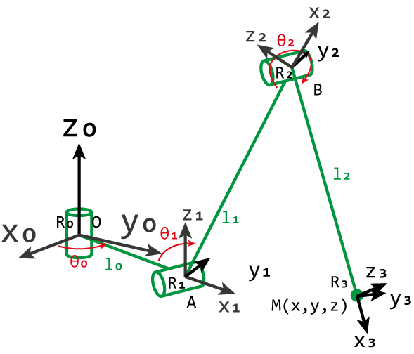
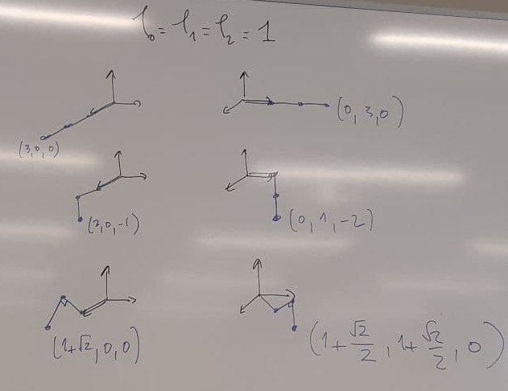

## Définition du problème

On cherche à trouver le modèle direct, i.e. l'expression de $(x,y,z)$ en fonction
de $(\theta_0, \theta_1, \theta_2)$, puis l'expression de $(\theta_0, \theta_1,
\theta_2)$ en fonction de $(x,y,z)$ (modèle inverse). Nous définissons le repère
$\mathcal{R}$ centré sur la première articulation de la patte (repère 0).

### Rappel sur les matrices de rotation

En 2D, rotation d'angle $\theta$ autour de l'origine : $rot_{(O,\theta)} = \begin{pmatrix} \cos{\theta} & - \sin{\theta} \\
\sin{\theta} & \cos{\theta} \end{pmatrix}$

En 3D, rotation d'angle $\theta$ autour de l'axe $(O,z)$ : $rot_{((O,z), \theta)} =
\begin{pmatrix}
\cos(\theta) & -\sin(\theta) & 0 \\
\sin(\theta) & \cos(\theta) & 0 \\
0 & 0 & 1
\end{pmatrix}$

## Modèle direct

Soit $A$ l'origine du repère 1 : $A = \begin{pmatrix}
l_0 \cos{\theta_0} \\ l_0 \sin{\theta_0} \\ 0 \end{pmatrix}_\mathcal{R}$.

Soit $B$ l'origine du repère 2 : $B = \begin{pmatrix}
l_1 \cos{(\pi - \theta_1 )} \\ 0 \\ l_1 \sin{(\pi - \theta_1)}\end{pmatrix}_{\mathcal{R}_1}$. On a donc, dans le repère 0 :

$$
\begin{aligned}
B_{\mathcal{R}} &= rot_{((O,z),\theta_0)} \cdot B_{\mathcal{R}_1} + A \\
&= \begin{pmatrix} \cos{\theta_0} & -\sin{\theta_0} & 0 \\
\sin{\theta_0} & \cos{\theta_0} & 0 \\
0 & 0 & 1 \end{pmatrix} \cdot \begin{pmatrix}
l_1 \cos{(\pi - \theta_1)} \\
0 \\
l_1 \sin{(\pi - \theta_1)}
\end{pmatrix} + \begin{pmatrix} l_0 \cos{\theta_0} \\ l_0 \sin{\theta_0} \\
0 \end{pmatrix}
\end{aligned}
$$

Soit $M$ le point au bout de la patte. Nous pouvons caractériser $\vec{BM}
= \begin{pmatrix} l_2 \cos{(\pi - \theta_2)} \\ 0 \\ l_2 \sin{(\pi -
\theta_2)} \end{pmatrix}_{\mathcal{R}_2}$.

Au final, on a $(x,y,z) = rot_{((O,z), \theta_0)} \cdot rot_{((O,y),
\pi-\theta_1)} \cdot \vec{BM}_{\mathcal{R}_2} + B_{\mathcal{R}}$.

## Modèle inverse

$$
\theta_0 = \arctan{\left(\dfrac{y}{x}\right)}
$$

(en pratique, on utilise $\operatorname{atan2}(y, x)$ pour obtenir le bon quadrant).

On note $d = AM = \sqrt{z^2 + (\sqrt{x^2+y^2} - l_0)^2}$ la distance entre la deuxième articulation $A$ et l'extrémité $M$. La loi des cosinus dans le triangle $ABM$ (côtés $AB = l_1$, $BM = l_2$, $AM = d$) donne :

$$
\theta_1 = \arctan\left(\dfrac{-z}{\sqrt{x^2+y^2}-l_0}\right) - \arccos\left(\dfrac{l_1^2 - l_2^2 + d^2}{2 l_1 d}\right) + \pi
$$

$$
\begin{aligned}
\theta_2 &= 2 \pi - \arccos{\left(\dfrac{-AM^2+BM^2+AB^2}{2 \times BM \times AB}\right)} \\
\theta_2 &= 2 \pi - \arccos{\left(\dfrac{-z^2-(\sqrt{x^2+y^2} -l_0)^2+l_2^2+l_1^2}{2 l_1 l_2}\right)}
\end{aligned}
$$

## Quelques exemples

- [Projet](./img/projetRobotique.zip)
