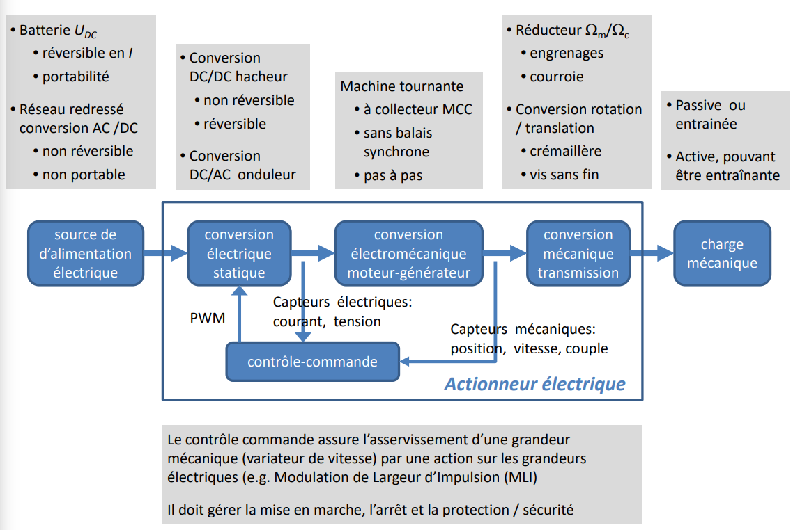
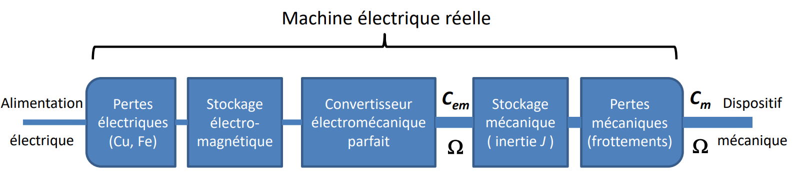

## Régime des grandeurs électriques rencontrées

Régime continu ou quasi-continu avec ondulation périodique (période $T$), valeur moyenne : $\langle x \rangle = \dfrac{1}{T} \int \limits_0^{T} x(t) dt$

Régime périodique (en particulier sinusoïdal), valeur efficace : $X = \left(\dfrac{1}{T}\int \limits_0^T x^2(t)dt\right)^{\frac{1}{2}}$

Régime quelconque périodique : décomposition en série de Fourier d'un signal $x(t)$ $T$-périodique, $x(t) = X_0 + \sum \limits_{k=1}^\infty (A_k \cos{k\omega t}+B_k \sin{k \omega t}) = X_0 + \sum \limits_{k=1}^\infty X_k \sqrt{2} \cos(k\omega t + \phi_k)$, où $X_0$ est la valeur moyenne, $\omega = 2 \pi f = 2\pi / T$ la pulsation du fondamental, $k$ le rang de l'harmonique, $X_k$ sa valeur efficace et $\phi_k$ son déphasage.

## Régime sinusoïdal (monophasé)

Soient les caractéristiques de la grandeur sinusoïdale $x$ : amplitude $X_m$ (ou $\hat{x}, X_p$), phase $\omega t + \phi_x$, phase à l'origine $\phi_x$ ; sa valeur efficace est $X = \dfrac{X_m}{\sqrt{2}}$.

### Principe de la correspondance expression temporelle / amplitude complexe

$$
\begin{aligned}
&\text{Grandeur instantanée} \Leftrightarrow \text{Grandeur complexe} \Leftrightarrow \text{Phaseur} \\
&x(t) = X_m \cos(\omega t + \phi_x) \Leftrightarrow \underline{x} = X_m e^{j(\omega t + \phi_x)} = X \sqrt{2} e^{j \omega t} e^{j \phi_x} \Leftrightarrow \underline{X} = X e^{j \phi_x}
\end{aligned}
$$

## Définition et utilisation des puissances

+ Puissance instantanée $p(t) = u(t) i(t)$ [W]
+ Puissance active $P = <p(t)> = \dfrac{1}{T} \int \limits_0^T p(t) dt$ [W]. En régime sinusoïdal, $P = UI \cos \phi$
+ Puissance apparente $S = UI$ [VA]
+ Facteur de puissance $F_P = \dfrac{P}{S}$. En régime sinusoïdal, $F_P = \cos \phi$
+ Puissance réactive $Q = UI \sin \phi$ [var]. En régime sinusoïdal, $S = \sqrt{P^2 + Q^2}$, $\tan \phi = \dfrac{Q}{P}$, $\cos \phi = \dfrac{P}{S}$, $\sin \phi = \dfrac{Q}{S}$
+ Puissance apparente complexe $\underline{S} = \underline{U} \underline{I}^\ast = P + jQ$ soit $P=Re(\underline{S})$, $Q = Im(\underline{S})$ et $S = | \underline{S} |$.

## Actionneur électrique

### Focus sur la conversion électromécanique

### Équations mécaniques

Principe fondamental de la dynamique en translation : $\sum \vec{F} = M.\vec{\gamma}$ avec $\gamma = \dot{v} = \ddot{x}$ ; la puissance s'exprime $P = F.v$. Dans le cas d'un actionneur électrique, même pour un besoin en translation, on utilisera très majoritairement une machine tournante. Le principe fondamental de la dynamique en rotation devient alors $\sum C = J . \dfrac{d\Omega}{dt} = C_m - C_r$ avec $\dot{\Omega} = \ddot{\theta}$ l'accélération angulaire ; la puissance s'exprime $P = C . \Omega$. Le besoin en entrainement se définira donc dans le plan mécanique couple - vitesse où on représentera le couple moteur $C_m$ et le couple résistant $C_r$.
