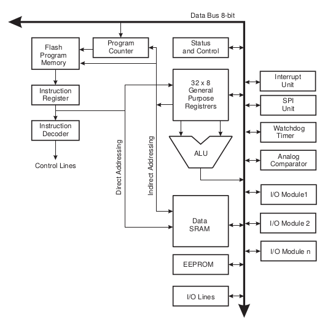

## Programmer un microcontrôleur

Un microcontrôleur peut posséder plusieurs types de mémoire : la RAM (volatile, rapide), la mémoire flash (non volatile, contenant le programme, plus lente en écriture) et l'EEPROM (non volatile, pour les données persistantes). L'espace d'adressage contient aussi des registres, qui permettent au programme de configurer et de piloter les périphériques.

Ces registres seront accessibles via une adresse. Le processeur va utiliser ces adresses pour modifier et analyser les différents bus de données en utilisant une architecture similaire à la suivante :

Les processeurs lisent les instructions de manière séquentielle, puis les exécutent ; le jeu d'instructions dépend de l'architecture de la machine.
