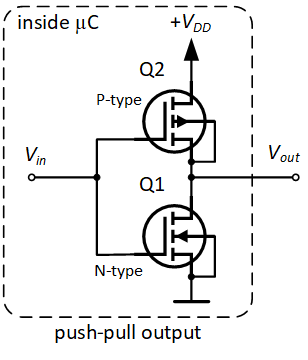
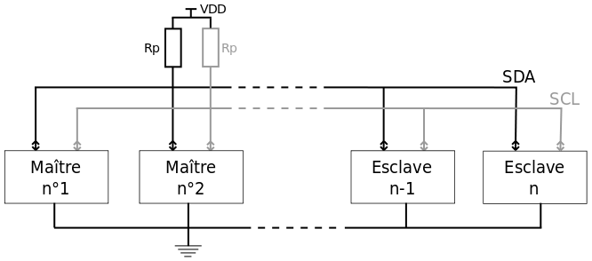
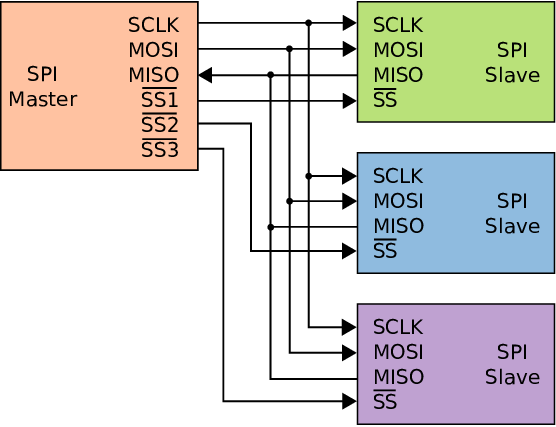

Les bus de communication standard sont nés de la nécessité de faire communiquer microcontrôleurs (MCU) et circuits intégrés (IC) ; ce cours en présente quelques-uns.

Avant de parler des bus, voyons comment fonctionnent les lignes électroniques physiques. Contrairement à la vision des informaticiens, une ligne électronique n'est pas seulement un 0 ou un 1 mais se trouve à un niveau de tension donné, avec une certaine impédance. Une ligne peut être pilotée à basse impédance en utilisant des transistors en push-pull :

Symboliquement, cela peut être représenté par un triangle, appelé pilote de ligne (*line driver*) :

Lorsqu'une ligne est une entrée en haute impédance et que rien n'est branché (la ligne est flottante), n'importe quelle tension peut être lue à cause de toutes les interférences. Si l'on veut imposer un niveau logique par défaut, il est nécessaire d'utiliser des résistances de tirage (*pull-up* ou *pull-down*).

## UART

L'UART, souvent appelé "liaison série", est l'un des bus de communication les plus connus. C'est un bus asynchrone : il n'y a pas d'horloge partagée, l'émetteur et le récepteur doivent donc convenir d'une même vitesse de communication (*baudrate*). Les octets sont transmis bit par bit, précédés d'un bit de start et suivis d'un ou plusieurs bits de stop, ce qui permet au récepteur de se resynchroniser à chaque octet.

## I2C / TWI

I2C (Inter-Integrated Circuit), ou TWI (Two Wire Interface) est un type de bus qui utilise deux fils, il est synchrone et half-duplex (SDA pour les données, SCL pour l'horloge). Ces lignes sont maintenues à un niveau de tension élevé par des résistances de pull-up et pilotées par des sorties à drain ouvert.

I2C est basé sur un protocole avec adresse, arbitrage et accusés de réception. Si plusieurs maîtres commencent une trame simultanément, l'arbitrage est mis en œuvre en surveillant le niveau de la ligne (si un maître lit un niveau bas alors qu'il laisse la ligne au niveau haut, il détecte une collision et abandonne sa trame). Ainsi, les adresses ayant des 0 dans les bits de poids fort sont prioritaires lors de l'arbitrage.

## SPI

SPI (Serial Peripheral Interface) est un bus synchrone et full-duplex. Sur un bus SPI, il y a un maître et plusieurs esclaves. Il utilise 4 lignes :

- SCK : l'horloge indiquant quand les bits sont transmis
- MOSI et MISO : respectivement sortie maître / entrée esclave et entrée maître / sortie esclave
- CS : indiquant à un esclave s'il est sélectionné (une ligne par esclave)

