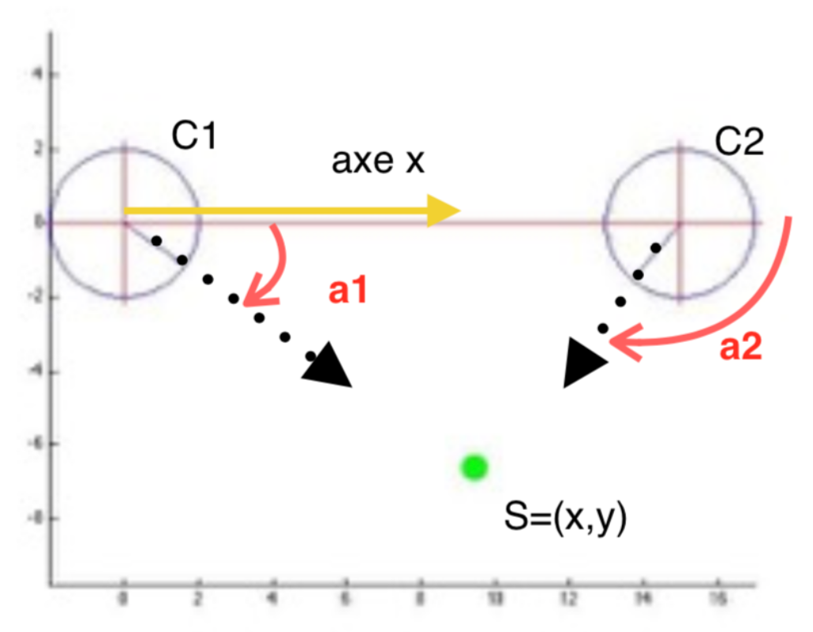

À partir d'une position initiale, le robot tourne de $\theta$ puis avance de $t$ puis tourne de $\alpha$ puis avance de $d$. Donner son positionnement dans le repère $(x,y,\theta)$.

- Le robot tourne de $\theta$ puis avance de $t$. Dans le repère $\Omega_O = (O, \vec{i}, \vec{j})$ :

$$
\vec{T}_{\Omega_O} = \begin{pmatrix} u\\ v \end{pmatrix} = t. \begin{pmatrix} \cos{\theta} \\ \sin{\theta} \end{pmatrix}
$$

- Puis, le robot tourne de $\alpha$ puis avance de $d$. Dans le repère $\Omega_C = (C, \vec{x}, \vec{y})$ :

$$
\vec{D}_{\Omega_C} = \begin{pmatrix} p\\ q \end{pmatrix} = d. \begin{pmatrix} \cos{\alpha} \\ \sin{\alpha} \end{pmatrix}
$$

## Modèles direct et inverse

On considère un bras plan à 3 articulations rotoïdes, de longueurs de segments $t_1$, $t_2$ et $t_3$.

- **Dans quel espace ?** : le mécanisme à 3 degrés de liberté.
- **Quelles sont les variables ?** : les entrées sont les angles articulaires $(\theta_1, \theta_2, \theta_3)$, les longueurs $t_i$ étant des paramètres.
- **Poser le problème** : dans le modèle direct, on souhaite trouver les coordonnées cartésiennes en fonction des $\theta_i$ et des longueurs $t_i$. Le modèle inverse lui fournit la position des différents joints $\theta$ en fonction de la position cartésienne de l'effecteur.

### Modèle direct : sorties en fonction des entrées

Enchaîner les changements de repère revient à composer, pour chaque segment, une rotation et une translation (produit des matrices de transformation).

$$
\mathcal{X} = \begin{pmatrix} t_1 \cos{\theta_1} + t_2 . \cos(\theta_1 + \theta_2) + t_3 . \cos(\theta_1 + \theta_2 + \theta_3) \\ t_1 \sin{\theta_1} + t_2 . \sin(\theta_1 + \theta_2) + t_3 . \sin(\theta_1 + \theta_2 + \theta_3) \\ \theta_1 + \theta_2 + \theta_3 \end{pmatrix}
$$

### Modèle inverse : entrées en fonction des sorties

Calculer le MGI revient à déterminer : $[\theta_1, \theta_2, \theta_3] = \mathcal{F}_{MGI}(X_1, X_2, X_3)$

Le système est non linéaire (fonctions trigonométriques) et peut admettre plusieurs solutions (par exemple coude en haut ou coude en bas).

Posons le système d'équations :

$$
\begin{cases}
t_1 .\cos{\theta_1} + t_2 \cos(\theta_1 + \theta_2) + t_3 \cos(\theta_1 + \theta_2 + \theta_3) - X_1 = 0 \\
t_1 . \sin{\theta_1} + t_2 \sin(\theta_1 + \theta_2) + t_3 \sin(\theta_1 + \theta_2 + \theta_3) - X_2 = 0 \\
\theta_1 + \theta_2 + \theta_3 = X_3
\end{cases}
$$

Pour résoudre ce problème, nous pouvons poser $\theta_3 = X_3 - \theta_1 - \theta_2$, ce qui ramène à deux équations à deux inconnues.

#### Résolution numérique : méthode de Newton

Nous cherchons à déterminer $x$ tel que $f(x) = 0$. Nous connaissons une approximation de $x$, notée $x_0$. Au premier ordre, $f(x) \approx f(x_0) + f'(x_0)(x-x_0)$ ; avec $f(x) = 0$, nous obtenons :
$$
x = x_0 - \dfrac{f(x_0)}{f'(x_0)}
$$

Le schéma de Newton est donc (en dimension supérieure, $f'$ est remplacée par la matrice jacobienne, que l'on inverse) :
$$
x_{k+1} = x_k - \dfrac{f(x_k)}{f'(x_k)}
$$

### Un exemple simple

$C_1$ et $C_2$ sont les positions des goniomètres, $a_1$ et $a_2$ sont les mesures angulaires et $S$ la position du robot.

Le point $S$ appartient à la droite issue de $C_i$ de direction $M_i$, donc $\overrightarrow{C_iS}$ est orthogonal à $M_i$ tourné de $\pi/2$. Nous pouvons déterminer les équations suivantes :

$$
\begin{align*}
M_1 &= \begin{pmatrix} u_1 \\ v_1 \end{pmatrix} = \begin{pmatrix} \cos{a_1} \\ \sin{a_1} \end{pmatrix} \\
M_2 &= \begin{pmatrix} u_2 \\ v_2 \end{pmatrix} = \begin{pmatrix} \cos{a_2} \\ \sin{a_2} \end{pmatrix} \\
\begin{pmatrix} x - c_{1_x} \\ y - c_{1_y} \end{pmatrix}^T \begin{pmatrix} \cos{\pi/2} & - \sin{\pi/2} \\ \sin{\pi / 2} & \cos{\pi / 2} \end{pmatrix} \begin{pmatrix} u_1 \\ v_1 \end{pmatrix} &= 0\\
\begin{pmatrix} x - c_{2_x} \\ y - c_{2_y} \end{pmatrix}^T \begin{pmatrix} \cos{\pi/2} & - \sin{\pi/2} \\ \sin{\pi / 2} & \cos{\pi / 2} \end{pmatrix} \begin{pmatrix} u_2 \\ v_2 \end{pmatrix} &= 0 \\
\begin{pmatrix} \sin{a_1} & - \cos{a_1} \\ \sin{a_2} & - \cos{a_2} \end{pmatrix} \begin{pmatrix} x \\ y \end{pmatrix} &= \begin{pmatrix} \sin{a_1}.c_{1_x} - \cos{a_1} c_{1_y} \\ \sin{a_2}.c_{2_x} - \cos{a_2} c_{2_y} \end{pmatrix} \\
A.S &= B
\end{align*}
$$

Nous cherchons donc à résoudre l'équation $A.x = b$ ; cependant, la résolution par $x = A^{-1}.b$ peut s'avérer impossible ou numériquement instable dans certaines situations (matrice singulière ou mal conditionnée, par exemple si les deux droites sont presque parallèles). Nous allons donc utiliser une décomposition en valeurs singulières (SVD) pour résoudre l'équation : $A = U.S.V^{T}$, avec $U$ et $V$ orthogonales et $S$ diagonale. [Détails sur la décomposition SVD](./img/svd.pdf)

### Résolution de systèmes sous-contraints

Soit le système $A_{n \times m} . x_{m \times 1} = b_{n \times 1}$ avec $n < m$ (moins d'équations que d'inconnues). Par exemple, $x_1 + x_2 = 4$ est un système sous-contraint. Il existe une infinité de solutions, et nous cherchons à en caractériser une : celle de norme minimale. La résolution se fait en calculant $\operatorname{argmin}_x H(x)$ avec le lagrangien $H(x) = x^{T} x + \lambda^T (Ax-b)$.

Pour résoudre des systèmes sous-contraints, nous allons avoir besoin d'une notion supplémentaire : la pseudo-inverse. La pseudo-inverse (à droite) d'une matrice $A$ de rang $n$ se définit comme : $A^+_{R} = A^T (AA^T)^{-1} = \sum
\limits_{i=1}^n \sigma_i^{-1} v_i u_i^T$, où les $\sigma_i$ sont les valeurs singulières de $A$ et $u_i$, $v_i$ les vecteurs singuliers associés.

La solution générale d'un système linéaire sous-contraint est donc $x = A^+_R b + \sum
\limits_{i=n+1}^m \alpha_i v_i$ (avec des $\alpha_i$ réels quelconques) $= A^+_R b + [I - A^+_RA] \omega$ (avec $\omega$ quelconque) ; $A^+_R b$ est la solution de norme minimale. Nous pouvons remarquer que $Ax=b \Leftrightarrow A(x+z) = b$ avec $Az =0$, $z$ est donc choisi dans le noyau de la matrice $A$.
